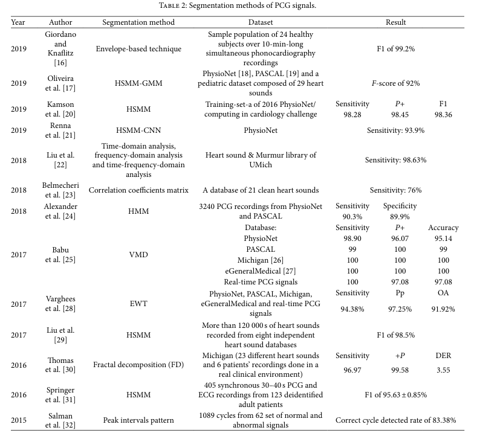

# Heart-Sound Research Repository  
A collection of **heart sound (PCG)**–related research resources including major labs, projects, datasets, review papers, segmentation methods, modeling approaches, and toolboxes. 
Related biosignals (ECG/EEG/PPG/etc.) are also included for broader context.

---

# Table of Contents

- [Heart-Sound Research Repository](#heart-sound-research-repository)
- [Laboratories & Projects](#-laboratories-and-projects)
- [Review Papers](#-review-papers)
- [Datasets (Open-Source)](#-datasets-open-source)
- [Pre-processing](#-pre-processing)
- [Segmentation](#-segmentation)
- [Modeling (Feature Extraction / Foundation Models) & Classification](#-modeling-feature-extraction--foundation-models--classification)
  - [Foundation Models](#-foundation-models)
  - [Task Models](#-task-models)
- [Evaluation](#-evaluation)
- [Research Toolboxes](#-research-toolboxes)

---

## 🧪 Common Biosignals
- **ECG** — Electrocardiography (heart electrical activity)  
- **EEG** — Electroencephalography (brain electrical activity)  
- **PPG** — Photoplethysmography (blood volume changes)  
- **PCG** — Phonocardiography (heart sounds)  
- **EMG** — Electromyography (muscle electrical activity)  

---

# 🏫 Laboratories and Projects

### • BoWang's Lab
- **Institution:** University of Toronto  
- **Link:** https://wanglab.ai/

### • The mHealth Research Group  
- **Institution:** BUET  
- **Link:** https://mhealth.buet.ac.bd/

### • The NTT Communication Science Laboratories  
- **Institution:** Kyushu University  
- **Links:**  
  - https://www.rd.ntt/e/  
  - https://scholar.google.com/citations?user=s3okiJkAAAAJ&hl=ja  

### • The Nokia Bell Labs  
- **Institution:** Nokia  
- **Link:** https://www.bell-labs.com/

### • The Cognitive Systems Lab  
- **Institution:** University of Bremen  
- **Link:** https://www.uni-bremen.de/csl  

### • The Computational Health Informatics (CHI) Lab  
- **Institution:** University of Oxford  
- **Link:** https://eng.ox.ac.uk/chi  

---

# 📚 Review Papers

### • *Foundation Models for Biosignals: A Survey* (2025)  
- Link: https://www.techrxiv.org/users/953631/articles/1322825/master/file/data/25_BFM_Survey/25_BFM_Survey.pdf

### • *A Comprehensive Survey on Heart Sound Analysis in the Deep Learning Era* (2023)  
- Repo: https://github.com/zhaoren91/awesome-heart-sound-analysis

### • *Deep Learning in Physiological Signal Data: A Survey* (2020, Sensors)

### • *A Review of Signal Processing Techniques for Heart Sound Analysis in Clinical Diagnosis* (2012)  
*Journal of Medical Engineering & Technology*  
**Key PCG drawbacks (important):**  
- Lack of frequency-domain information about heart sound components  
- Cannot differentiate frequencies or energy variations in components  
- Noise/artifacts mask weak heart sounds  
- Difficult to identify precise heart sound boundaries
  
---

# 📂 Datasets (Open-Source)

### • **BMD-HS Dataset** (2024)  
https://github.com/sani002/BMD-HS-Dataset/tree/main

### • **Heart Sound Dataset (for BP monitoring)**  
https://github.com/Victoria510/HS-BP

### • **ZCHSound Dataset**  
http://zchsound.ncrcch.org.cn/dataset

### • **Heart Sounds Shenzhen Corpus (HSS)** (2019)  
http://43.163.195.227/hss/

### • **PhysioNet Challenge Dataset** (2016)  
https://physionet.org/content/challenge-2016/1.0.0/files

### • **CirCor DigiScope Dataset** (2014–2015)  
https://physionet.org/content/circor-heart-sound/

### • **PASCAL Heart Sound Challenge** (2011)  
https://istethoscope.peterjbentley.com/heartchallenge

---

# 🔧 Pre-processing

### • Logistic Regression HSMM-Based Heart Sound Segmentation  
- Paper: https://ieeexplore.ieee.org/document/7234876/  
- Year: 2015  

---

# ✂️ Segmentation

---

# 🤖 Modeling (Feature Extraction / Foundation Models) & Classification

## 🧱 Foundation Models

### • Pulse-PPG: Field-Trained PPG Foundation Model (2025)  
- Paper: https://arxiv.org/abs/2502.01108  
- Code: https://github.com/maxxu05/pulseppg

### • *Foundation Models for Cardiovascular Disease Detection via Biosignals from Digital Stethoscopes* (2024, Nature npj Cardiovascular Health)  
- Paper: https://www.nature.com/articles/s44325-024-00027-5

### • ECG-FM: An Open Electrocardiogram Foundation Model (2024)  
- Paper: https://arxiv.org/pdf/2408.05178  
- Code: https://github.com/bowang-lab/ECG-FM  

### • PAPAGEI: Open Foundation Models for Optical Physiological Signals (2024)  
- Paper: https://arxiv.org/html/2410.20542v1  
- Code: https://github.com/Nokia-Bell-Labs/papagei-foundation-model  

---

## 🎯 Task Models

### • Assessing Utility of Audio Foundation Models for Heart & Respiratory Sound Analysis (2025)  
- Paper: https://arxiv.org/pdf/2504.18004  

### • AuscMLLM: Multimodal LLM for Heart Sound Analysis (2025)  
- Paper: https://ieeexplore.ieee.org/abstract/document/10889373  

### • HSDreport: Heart Sound Diagnosis with Echocardiography Reports (2024)  
- Paper: https://arxiv.org/abs/2408.08669  

### • Heart Sound Classification Using Deep Learning and Log-Mel Spectrogram (2023)  
- Paper: https://link.springer.com/article/10.1007/s00034-022-02124-1  
- Code: https://github.com/tuanktcs/Heart-sound-classification  

### • Deep Attention-Based Representation Learning for Heart Sound Classification (2021)  
- Paper: https://arxiv.org/abs/2101.04979  

---

# 📊 Evaluation

### • *Listening to the Heart: Unifying Open Audio Databases for Cardiology Research* (2024)  
- Paper: https://mobile-systems.cl.cam.ac.uk/papers/cinc24.pdf  

---

# 🧰 Research Toolboxes

### • **torch_ecg**  
https://github.com/DeepPSP/torch_ecg  
- Deep learning framework for ECG using PyTorch  

### • **BIOBSS**  
https://github.com/obss/BIOBSS  
- Processing for wearable sensor signals (ECG/PPG/EDA/ACC)

### • **BioSPPy**  
https://github.com/PIA-Group/BioSPPy
and 
https://github.com/scientisst/BioSPPy (new)
- Comprehensive biosignal processing toolkit  
- Supports BVP, ECG, EDA, EEG, EMG, PCG, PPG, respiration  
- Includes filtering, frequency analysis, clustering, biometrics
- can now evaluate the quality of your signals (only support ECG and EDA signals)
  

---
