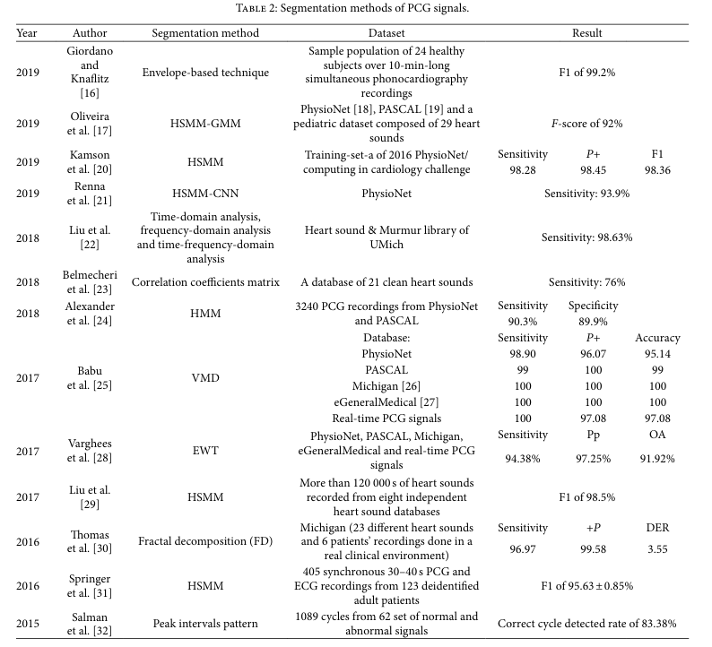

# Heart-Sound Research Repository  
A collection of **heart sound (PCG)**–related research resources including major labs, projects, datasets, review papers, segmentation methods, modeling approaches, and toolboxes. 
Related biosignals (ECG/EEG/PPG/etc.) are also included for broader context.

---

# Table of Contents

- [Common Biosignals](#-common-biosignals)
- [Laboratories & Projects](#-laboratories-and-projects)
- [Review Papers](#-review-papers)
- [Datasets (Open-Source)](#-pcg-datasets-open-source)
- [Pre-processing](#-pre-processing)
- [Segmentation](#-segmentation)
- [Modeling (Feature Extraction / Foundation Models) & Classification](#-modeling-feature-extraction--foundation-models--classification)
  - [Foundation Models](#-foundation-models)
  - [Task Models](#-task-models)
- [Evaluation](#-evaluation)
- [Research Toolboxes](#-research-toolboxes)
- [Related works](#related-works)

---

## 🧪 Common Biosignals
- **ECG** — Electrocardiography (heart electrical activity)  
- **EEG** — Electroencephalography (brain electrical activity)  
- **PPG** — Photoplethysmography (blood volume changes)  
- **PCG** — Phonocardiography (heart sounds)  
- **EMG** — Electromyography (muscle electrical activity)  

---

# 🏫 Laboratories and Projects

### • The zitniklab
- **Institution:** Harvard University
- **Link:**
  - https://zitniklab.hms.harvard.edu/
  - https://github.com/mims-harvard
    
### • The Digital Health Lab
- **Institution:** Samsung Research America
- **Link:**
  - https://sra.samsung.com/research-area/digital-health/
  - https://sra.samsung.com/publications/
    
### • The MIT-LCP
- **Institution:** MIT
- **Link:** https://lcp.mit.edu/

### • The BoWang's Lab
- **Institution:** University of Toronto  
- **Link:** https://wanglab.ai/

### • The mHealth Research Group  
- **Institution:** BUET  
- **Link:** https://mhealth.buet.ac.bd/

### • The NTT Communication Science Laboratories  
- **Institution:** Kyushu University  
- **Links:**  
  - https://www.rd.ntt/e/  
  - https://scholar.google.com/citations?user=s3okiJkAAAAJ&hl=ja  

### • The Nokia Bell Labs  
- **Institution:** Nokia  
- **Link:** https://www.bell-labs.com/

### • The Cognitive Systems Lab  
- **Institution:** University of Bremen  
- **Link:** https://www.uni-bremen.de/csl  

### • The Computational Health Informatics (CHI) Lab  
- **Institution:** University of Oxford  
- **Link:** https://eng.ox.ac.uk/chi  

---

# 📚 Review Papers

### • *Foundation Models for Biosignals: A Survey*
- Link: https://www.techrxiv.org/users/953631/articles/1322825/master/file/data/25_BFM_Survey/25_BFM_Survey.pdf
- 2025
  
### • *A Comprehensive Survey on Heart Sound Analysis in the Deep Learning Era*
- Repo: https://github.com/zhaoren91/awesome-heart-sound-analysis
- 2023

### • *Deep Learning in Physiological Signal Data: A Survey*
- Link: https://www.mdpi.com/1424-8220/20/4/969
- 2020

### • *A Review of Signal Processing Techniques for Heart Sound Analysis in Clinical Diagnosis*
*Journal of Medical Engineering & Technology*  
**Key PCG drawbacks (important):**  
- Lack of frequency-domain information about heart sound components  
- Cannot differentiate frequencies or energy variations in components  
- Noise/artifacts mask weak heart sounds  
- Difficult to identify precise heart sound boundaries
  
---

# 📂 PCG Datasets (Open-Source)

### • **Descriptor: Heart and Lung Sounds Dataset Recorded From a Clinical Manikin Using Digital Stethoscope (HLS-CMDS)** (2025)  
https://github.com/Torabiy/HLS-CMDS

### • **Synthetic Heart Sound Dataset** (2023)  
https://arrow.tudublin.ie/datas/20/

### • **The CirCor DigiScope Phonocardiogram Dataset** (2022)  
https://physionet.org/content/circor-heart-sound/1.0.3/

### • **BMD-HS Dataset** (2024)  
https://github.com/sani002/BMD-HS-Dataset/tree/main

### • **Heart Sound Dataset (for BP monitoring)**  
https://github.com/Victoria510/HS-BP

### • **ZCHSound Dataset**  
http://zchsound.ncrcch.org.cn/dataset

### • **Heart Sounds Shenzhen Corpus (HSS)** (2019)  
http://43.163.195.227/hss/

### • **PhysioNet Challenge Dataset** (2016)  
https://physionet.org/content/challenge-2016/1.0.0/files

### • **PASCAL Heart Sound Challenge** (2011)  
https://istethoscope.peterjbentley.com/heartchallenge

---

# 🔧 Pre-processing

### • Logistic Regression HSMM-Based Heart Sound Segmentation  
- Paper: https://ieeexplore.ieee.org/document/7234876/  
- Year: 2015  

---

# ✂️ Segmentation

### • Unsupervised segmentation of heart sounds from abrupt changes detection 
- Paper: https://doi.org/10.1016/j.compbiomed.2025.109712  
- Year: 2025

### • TOPSEG: A MULTI-SCALE TOPOLOGICAL FRAMEWORK FOR DATA-EFFICIENT HEART SOUND SEGMENTATION
- Paper: https://arxiv.org/pdf/2510.17346
- Year: 2025
  
### • A Deep-Learning-Based Multi-modal ECG and PCG Processing Framework for Label Efficient Heart Sound Segmentation 
- Paper: https://ieeexplore.ieee.org/stamp/stamp.jsp?tp=&arnumber=10614435
- Year: 2024
  
### • Logistic Regression-HSMM-Based Heart Sound Segmentation  
- Paper: https://ieeexplore.ieee.org/document/7234876
- Year: 2016
- Code: https://github.com/davidspringer/Springer-Segmentation-Code

---

# 🤖 Modeling (Feature Extraction / Foundation Models) & Classification

## 🧱 Foundation Models
    
### • Physiology-Aware Masked Cross-Modal Reconstruction for Biosignal Representation Learning
- Paper: https://openreview.net/attachment?id=xXRqWpt3Xr&name=pdf, https://arxiv.org/pdf/2605.00973
- Code: https://github.com/hzhou3/xMAE
- ICML2026
- ECG, PPG, relationship (!!!)
  
### • Benchmarking ECG Foundational Models: A Reality Check Across Clinical Tasks
- Paper: https://openreview.net/attachment?id=xXRqWpt3Xr&name=pdf
- Code: None (waiting...)
- ICLR2026
- ECG
  
### • HIMAE: HIERARCHICAL MASKED AUTOENCODERS DISCOVER RESOLUTION-SPECIFIC STRUCTURE IN WEARABLETIMESERIES
- Paper: https://openreview.net/attachment?id=iPAy5VpGQa&name=pdf
- Code: None (waiting...)
- ICLR2026
- ECG, PPG
  
### • GEM:Empowering MLLM for Grounded ECG Understanding with Time Series and Images
- Paper: https://openreview.net/attachment?id=idtZwmjakN&name=pdf
- Code: https://github.com/lanxiang1017/GEM
- NeurIPS2025
- ECG, text pair
  
### • MIRA: Medical Time Series Foundation Model for Real-World Health Data
- Paper: https://openreview.net/attachment?id=Auy2DmlJBO&name=pdf
- Code: https://github.com/microsoft/MIRA
- NeurIPS2025
- EEG, ECG
  
### • LUNA:Efficient and Topology-Agnostic Foundation Model for EEG Signal Analysis
- Paper: https://openreview.net/attachment?id=uazfjnFL0G&name=pdf
- Code: https://github.com/pulp-bio/biofoundation
- NeurIPS2025
- EEG
  
### • Learning Without Augmenting: Unsupervised Time Series Representation Learning via Frame Projections
- Paper: https://openreview.net/attachment?id=LwPjJHVWSn&name=pdf
- Code: https://github.com/eth-siplab/Learning-with-FrameProjections
- NeurIPS2025
- PPG, ECG, EEG
  
### • SensorLM: Learning the Language of Wearable Sensors
- Paper: https://openreview.net/attachment?id=TrHeq0yFhv&name=pdf
- Code: https://github.com/Google-Health/consumer-health-research/tree/main/sensorlm
- NeurIPS2025
- PPG, text pair
  
### • REVE: A Foundation Model for EEG - Adapting to Any Setup with Large-Scale Pretraining on 25,000 Subjects
- Paper: https://openreview.net/attachment?id=ZeFMtRBy4Z&name=pdf
- Code: https://brain-bzh.github.io/reve/
- NeurIPS2025
- EEG

### • CSBrain: A Cross-scale Spatiotemporal Brain Foundation Model for EEG Decoding
- Paper: https://openreview.net/attachment?id=agcXjEHmyW&name=pdf
- Code: https://github.com/yuchen2199/CSBrain
- NeurIPS2025
- EEG

### • PhysioWave: A Multi-Scale Wavelet-Transformer for Physiological Signal Representation  
- Paper: https://arxiv.org/pdf/2506.10351  
- Code: https://github.com/ForeverBlue816/PhysioWave
- NeurIPS2025
- ECG, EMG

### • Wavelet-Based Masked Multiscale Reconstruction for PPG Foundation Models
- Paper: https://openreview.net/pdf?id=kJbY2CsTPb  
- Code: None
- NeurIPS2025
- PPG
  
### • Fat: Frequency-aware pretraining for enhanced time-series representation learning  
- Paper: https://dl.acm.org/doi/10.1145/3711896.3736952
- Code: https://github.com/JiaXiangfei/FAT
- KDD2025
- EMG

### • TolerantECG: A Foundation Model for Imperfect Electrocardiogram
- Paper: https://arxiv.org/pdf/2507.09887
- Code: https://github.com/Fsoft-AIC/TolerantECG
- ACMMM2025
- ECG-text
   
### • Frequency-masked embedding inference: A non-contrastive approach for time series representation learning 
- Paper: https://arxiv.org/abs/2412.20790
- Code: https://github.com/USTBInnovationPark/Frequencymasked-Embedding-Inference
- AAAI2025
- EEG, EMG
   
### • RELCON: RELATIVE CONTRASTIVE LEARNING FOR A MOTION FOUNDATION MODEL FOR WEARABLE DATA 
- Paper: https://arxiv.org/pdf/2411.18822  
- Code: https://github.com/maxxu05/relcon
- ICLR2025
- PPG

### • Pulse-PPG: An Open-Source Field-Trained PPG Foundation Model for Wearable Applications Across Lab and Field Settings 
- Paper: https://arxiv.org/abs/2502.01108  
- Code: https://github.com/maxxu05/pulseppg
- UbiComp2025
- PPG
  
### • Multi frequency contrastive learning representation for time series
- Paper: https://openreview.net/pdf?id=ecO7WOIlMD
- Code: https://github.com/duanjufang/MF-CLR
- ICML2024
- ECG, EMG
 
### • REBAR: RETRIEVAL-BASED RECONSTRUCTION FOR TIME-SERIES CONTRASTIVE LEARNING
- Paper: https://arxiv.org/pdf/2311.00519 
- Code: https://github.com/maxxu05/rebar
- ICLR2024
- PPG

### • Foundation Models for Cardiovascular Disease Detection via Biosignals from Digital Stethoscopes
- Paper: https://www.nature.com/articles/s44325-024-00027-5
- Code: None
- Npj Cardiovascular Health2024
- PCG, ECG

### • ECG-FM: An Open Electrocardiogram Foundation Model 
- Paper: https://arxiv.org/pdf/2408.05178  
- Code: https://github.com/bowang-lab/ECG-FM
- arxiv2024
- ECG

### • PAPAGEI: Open Foundation Models for Optical Physiological Signals
- Paper: https://arxiv.org/html/2410.20542v1  
- Code: https://github.com/Nokia-Bell-Labs/papagei-foundation-model
- ICLR2024
- PPG

### • Self-supervised contrastive pre-training for time series via time-frequency consistency
- Paper: https://openreview.net/forum?id=OJ4mMfGKLN  
- Code: https://github.com/mims-harvard/TFC-pretraining
- NeurIPS2022
- EEG, ECG, EMG

  
---

## 🎯 Task Models

### • Scaling to Multimodal and Multichannel Heart Sound Classification with Synthetic and Augmented Biosignals
- Paper: https://arxiv.org/pdf/2509.11606
- code: https://github.com/MilanMarocchi/noise-robust-cad-conformer
- arxiv2025
- PCG, ECG

### • Noise-Robust Contrastive Learning with an MFCC-Conformer For Coronary Artery Disease Detection
- Paper: https://arxiv.org/pdf/2601.18295
- code: https://github.com/MilanMarocchi/noise-robust-cad-conformer
- ICASSP2026
- PCG (!!!)

### • Assessing Utility of Audio Foundation Models for Heart & Respiratory Sound Analysis
- Paper: https://arxiv.org/pdf/2504.18004
- 2025

### • AuscMLLM: Multimodal LLM for Heart Sound Analysis 
- Paper: https://ieeexplore.ieee.org/abstract/document/10889373
- 2025

### • HSDreport: Heart Sound Diagnosis with Echocardiography Reports
- Paper: https://arxiv.org/abs/2408.08669
- 2024

### • Heart Sound Classification Using Deep Learning and Log-Mel Spectrogram
- Paper: https://link.springer.com/article/10.1007/s00034-022-02124-1  
- Code: https://github.com/tuanktcs/Heart-sound-classification
- 2023

### • Deep Attention-Based Representation Learning for Heart Sound Classification
- Paper: https://arxiv.org/abs/2101.04979
- 2021

---

# 📊 Evaluation

### • *CaReCoS: A Spectrogram based Visual Benchmark for Cardiac, Respiratory and Cough Sounds*
- Paper: https://arxiv.org/pdf/2607.03356
- 2026

### • *MuteBench: Modality Unavailability Tolerance Evaluation for Incomplete Multimodal Fusion*
- Paper: https://arxiv.org/pdf/2605.15235
- 2026

### • *Comparative Analysis of CNN and Transformer Architectures with Heart Cycle Normalization for Automated Phonocardiogram Classification*
- Paper: https://arxiv.org/pdf/2507.07058
- EMBC
- 2025

### • *Listening to the Heart: Unifying Open Audio Databases for Cardiology Research*
- Paper: https://mobile-systems.cl.cam.ac.uk/papers/cinc24.pdf
- 2024

---

# 🧰 Research Toolboxes

### • **torch_ecg**  
https://github.com/DeepPSP/torch_ecg  
- Deep learning framework for ECG using PyTorch  

### • **BIOBSS**  
https://github.com/obss/BIOBSS  
- Processing for wearable sensor signals (ECG/PPG/EDA/ACC)

### • **BioSPPy**  
https://github.com/PIA-Group/BioSPPy
and 
https://github.com/scientisst/BioSPPy (new)
- Comprehensive biosignal processing toolkit  
- Supports BVP, ECG, EDA, EEG, EMG, PCG, PPG, respiration  
- Includes filtering, frequency analysis, clustering, biometrics
- can now evaluate the quality of your signals (only support ECG and EDA signals)

### • **fairseq**  
https://github.com/facebookresearch/fairseq  
- Handle audio signals
- Sequence-to-Sequence Toolkit

---

# Related works

### • Domain Knowledge is Power: Leveraging Physiological Priors for Self-Supervised Representation Learning in Electrocardiography
- Paper: https://arxiv.org/pdf/2509.08116
- Code: https://github.com/nooshinmaghsoodi/PhysioCLR
- TBME2025

### • Position: A Dynamical Systems Perspective is Needed to Advance Time Series Modeling
- Paper: https://arxiv.org/pdf/2602.16864
- Code: None
- ICML2026

### • DECENTRALIZED ATTENTION FAILS CENTRALIZED SIGNALS: RETHINKING TRANSFORMERS FOR MEDICAL TIME SERIES
- Paper: https://openreview.net/attachment?id=oZJFY2BQt2&name=pdf
- Code: https://anonymous.4open.science/r/TeCh-24 (update)
- ICLR2026

### • CAN WE GENERATE PORTABLE REPRESENTATIONS FOR CLINICAL TIME SERIES DATA USING LLMS ?
- Paper: https://openreview.net/attachment?id=pXw0uRTSKT&name=pdf
- Code: https://github.com/l-h-y168/DCBoost
- ICLR2026

### • You Can Trust Your Clustering Model: A Parameter-free Self-Boosting Plug-in for Deep Clustering
- Paper: https://openreview.net/attachment?id=JqyEIr41M4&name=pdf
- Code: https://github.com/l-h-y168/DCBoost
- NeurIPS2025

### • Multi-Scale Finetuning for Encoder-based Time Series Foundation Models
- Paper: https://openreview.net/attachment?id=OPOBV0zXu7&name=pdf
- Code: https://github.com/zqiao11/MSFT
- NeurIPS2025

### • AdaLRS: Loss-Guided Adaptive Learning Rate Search for Efficient Foundation Model Pretraining
- Paper: https://openreview.net/attachment?id=Rc489jcc30&name=pdf
- Code: None
- NeurIPS2025

### • ComRank: Ranking Loss for Multi-Label Complementary Label Learning
- Paper: https://openreview.net/attachment?id=uVjuiPP4aP&name=pdf
- Code: https://github.com/JellyJamZhu/ComRank
- NeurIPS2025

### • Understanding and Enhancing Mask-Based Pretraining towards Universal Representations
- Paper: https://openreview.net/attachment?id=oQbTbio99T&name=pdf
- Code: https://github.com/MingzeDong/r2mae
- NeurIPS2025

### • Understanding Contrastive Learning via Gaussian Mixture Models
- Paper: https://openreview.net/attachment?id=nCAdkkAeR9&name=pdf
- Code: None
- NeurIPS2025

### • Adaptive and Multi-scale Affinity Alignment for Hierarchical Contrastive Learning
- Paper: https://openreview.net/attachment?id=sZ22INHr9H&name=pdf
- Code: None
- NeurIPS2025

---

